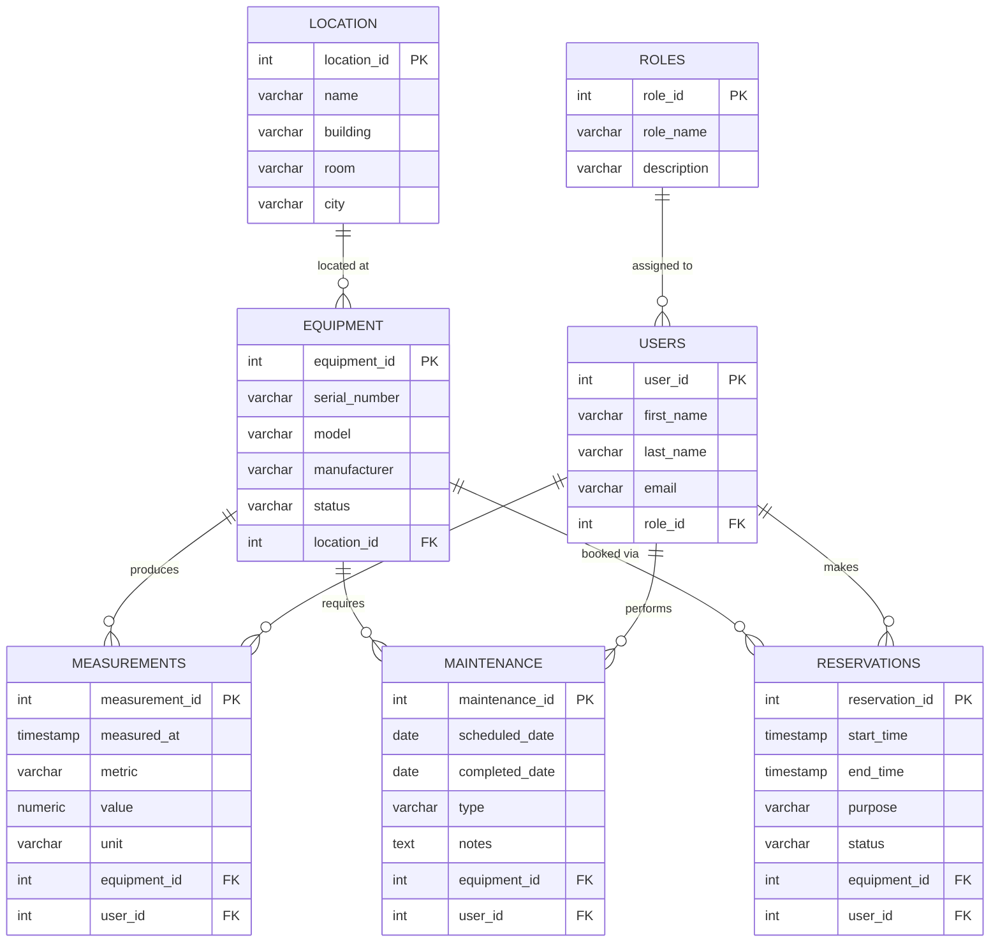

# IoT Equipment Database

A relational database schema designed for managing IoT equipment, users, measurements, maintenance, and reservations. Built for Azure SQL Database as part of a team project.

---

## Database Structure

The schema consists of 7 linked tables. `equipment` is the central table — measurements, maintenance records, and reservations all connect to it. `location` describes where each device is deployed, and `users` are linked to `roles` for access control.

---

## Tables

**1. location** — Physical location of each device (building, room, city).

**2. equipment** — Individual IoT devices, each linked to a location.

**3. roles** — User roles defining access levels (admin, technician, viewer).

**4. users** — Team members using the system, each assigned a role.

**5. measurements** — Sensor readings recorded by a user from a specific device.

**6. maintenance** — Scheduled and completed maintenance tasks per device.

**7. reservations** — Equipment booking records made by users.

---

## Files

| File | Description |
|------|-------------|
| `iot_database.sql` | Full schema with CREATE TABLE, INSERT, and SELECT statements |

---

## How to Run

1. Create a new database on Azure SQL.
2. Open a query editor (Azure Portal or Azure Data Studio).
3. Copy and run the contents of `iot_database.sql`.

---

## Team

1. Aliyyu Zen-Abdeen
2. Madhusan Regmi
3. Pratibha Gyawali
4. Md Nihon Mostari Siam
5. Prabhunath Kalwar.
