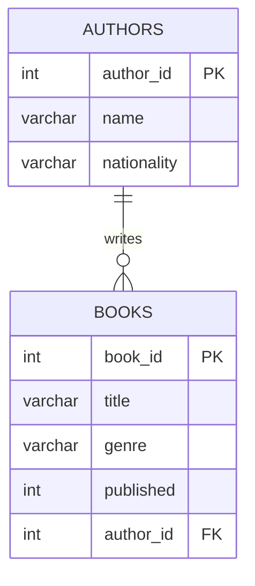
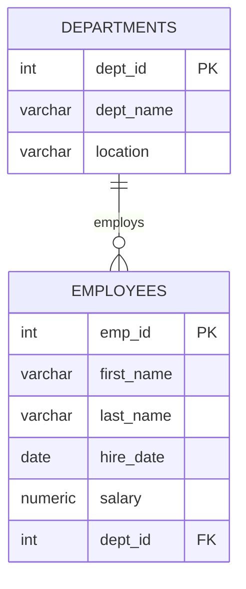
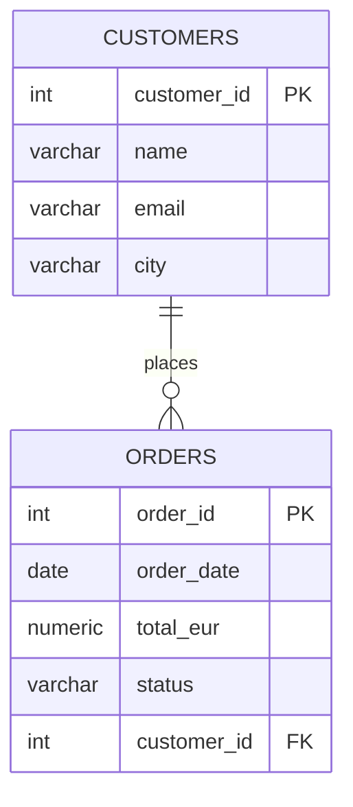
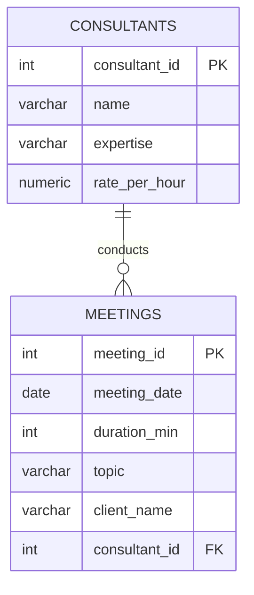
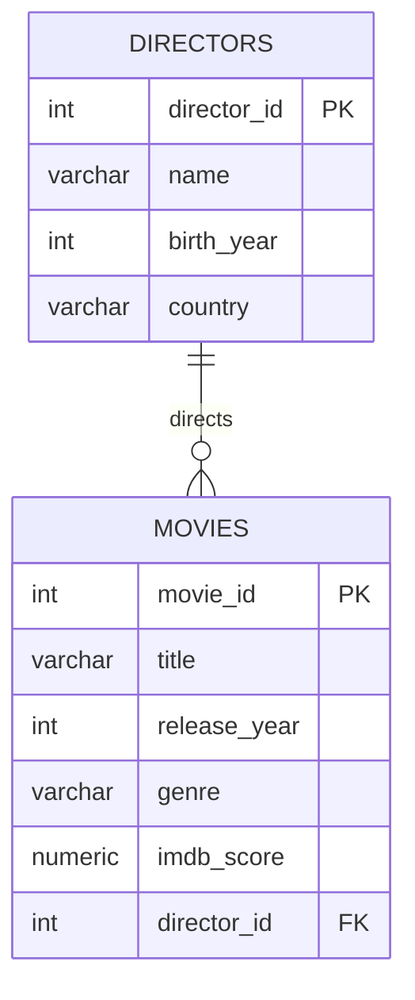

# Database Tasks

A collection of five relational database designs, each containing two linked tables, sample data, and a SELECT query. Created as a course assignment.

---

## Scenarios

### 1. Books and Authors
Stores books and their authors. Each book is linked to one author via a foreign key.

---

### 2. Departments and Employees
Stores employees and the department they belong to. Each employee is linked to one department.

---

### 3. Customers and Orders
Stores customer orders. Each order is linked to one customer.

---

### 4. Consultants and Meetings
Stores consultant meetings with clients. Each meeting is linked to one consultant.

---

### 5. Directors and Movies
Stores movies and their directors. Each movie is linked to one director.

---

## Files

| File | Description |
|------|-------------|
| `1_books_and_authors.sql` | Books and Authors — CREATE TABLE, INSERT, SELECT |
| `2_departments_and_employees.sql` | Departments and Employees — CREATE TABLE, INSERT, SELECT |
| `3_customers_and_orders.sql` | Customers and Orders — CREATE TABLE, INSERT, SELECT |
| `4_consultants_and_meetings.sql` | Consultants and Meetings — CREATE TABLE, INSERT, SELECT |
| `5_directors_and_movies.sql` | Directors and Movies — CREATE TABLE, INSERT, SELECT |

---

## How to Run

1. Open your SQL client (e.g. Azure Data Studio, DBeaver, or pgAdmin).
2. Connect to your database.
3. Open and run each file individually in any order — they are fully independent of each other.
